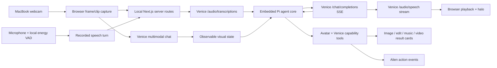

# Venice Alien — Venice-only implementation plan

## 1. Non-negotiable architecture rule

Every AI inference request must go through the Venice API at:

```text
https://api.venice.ai/api/v1
```

There will be:

- no direct xAI API calls;
- no direct OpenAI, ElevenLabs, Google, Anthropic, or other model-provider calls;
- no local AI model for face, speech, language, image, or video inference;
- one server-side `VENICE_API_KEY`, supplied by the user and never exposed to browser code.

Provider models may still be selected when Venice offers them. For example, `stt-xai-v1` and `tts-xai-v1` are accessed through Venice, billed by Venice, and authenticated only with the Venice key.

The official [veniceai/skills](https://github.com/veniceai/skills) repository is the integration source of truth. Its skills are derived from the live Venice OpenAPI specification and cover chat, multimodal input, model discovery, images, speech, transcription, music, video, characters, augmentation, billing, and errors.

## 2. Product definition

Build a polished local demo of a voice-first AI companion that:

- sees the user through the MacBook webcam using Venice vision models;
- recognizes observable facial expressions, head direction, and useful hand gestures from sampled frames;
- listens through the microphone, transcribes with Venice, reasons/chats with Venice, and speaks with Venice;
- uses Venice-hosted xAI speech models by default if listening tests confirm they provide the best result;
- shows live conversation text and also accepts typed messages;
- appears as one expressive alien-style character with an original audio-reactive voice halo;
- can smile, blink, wink, nod, shake its head, look around, react, and approximate an Animoji-like mirror mode when asked;
- can use Venice text/reasoning/search, vision, characters, image, video, music, and media-editing capabilities;
- exposes voice, language, personality, vision frequency, and Venice model choices in a polished settings panel;
- runs locally with one command and a deliberately small dependency set.

This is a convincing demo, not a production platform. It should feel finished on camera, but it does not need user accounts, cloud deployment, a database, multi-user isolation, or permanent media storage.

## 3. Honest capability boundary

Venice currently exposes transcription and TTS as HTTP endpoints, chat as HTTP/SSE, and vision through multimodal chat. It does not expose one browser WebSocket that continuously consumes microphone and camera data while returning speech.

The demo will therefore use a low-latency cascaded loop:

```text
microphone turn
  → Venice transcription
  → Venice streaming chat + tools
  → Venice streaming speech
  → speakers
```

This can feel conversational and support interruption, but it is not true full-duplex speech-to-speech. Similarly, Venice-only vision can identify expressions and movements from frequent snapshots or short clips, but cannot provide the 60 fps facial mesh of a local Animoji tracker. The UI will interpolate between Venice observations to create smooth character motion without pretending the underlying detection is continuous.

## 4. Experience and design direction

### Main screen

The central stage is a dark, cinematic canvas with a single custom SVG alien face. It reads as an emoji-like character, but the artwork is original and parameterized so its eyes, mouth, brows, cheeks, and head angle can animate.

Around the alien is an “aurora halo”: layered blurred rings and a softly deforming gradient membrane driven by local microphone/output-audio amplitude. It communicates state without copying Siri or ChatGPT.

| State | Motion and color language |
| --- | --- |
| Idle | Slow breathing, dim mint and indigo |
| Listening | Inward ripples, cool cyan, live input level |
| Transcribing | Tight blue orbit with a short status label |
| Thinking | Violet orbit and traveling highlight |
| Speaking | Bright lime/cyan expansion tied to output audio |
| Using Venice tool | Amber satellites and human-readable tool status |
| Generating media | Slow amber progress orbit around a thumbnail |
| Error/disconnected | Muted coral pulse with a recovery action |

The visual language should be spacious, cinematic, and tactile: excellent motion timing, subtle texture, large readable type, restrained glass surfaces, no generic component-library dashboard.

### Supporting UI

- Top bar: agent name, Venice connection/credit state, camera privacy status, settings.
- Optional mirrored webcam tile: hidden by default, easy to reveal, with a visible “frames sent to Venice” indicator.
- Transcript panel: partial/final conversation text, tool calls, citations, and media results inline.
- Composer: text input, large start/stop control, mute, camera toggle, and attachments.
- Media tray: generated images, edited images, music, and videos remain available during the session.
- Settings drawer:
  - agent name, personality, and optional Venice character;
  - Venice chat model and reasoning level;
  - Venice transcription model;
  - Venice TTS model, voice, language, speed, and preview;
  - camera device, vision model, frame frequency, and detail level;
  - image, video, and music defaults;
  - cost confirmation thresholds and privacy controls.

### Character behavior

The avatar has two animation layers:

1. **Ambient animation:** breathing, micro-saccades, blinking, anticipatory reactions, and audio-driven mouth movement.
2. **Directed animation:** Venice tool-triggered actions including `smile`, `laugh`, `surprised`, `frown`, `wink`, `nod`, `shake`, `look_left`, `look_right`, `tilt`, `bounce`, `start_mirroring`, and `stop_mirroring`.

When the user says “smile,” the Venice chat model calls the avatar action tool before confirming verbally. In mirror mode, the latest Venice visual observation drives the alien’s expression and head pose, with interpolation and brief procedural micro-motion between observations.

## 5. Minimal local stack

- Next.js + React + TypeScript for one frontend/server process.
- `@earendil-works/pi-agent-core` for the embedded agent loop, conversation state, and tool execution.
- `@earendil-works/pi-ai` for the Venice-backed chat model adapter where its OpenAI-compatible types fit.
- Vanilla CSS and inline SVG for all design and avatar animation.
- Browser Media Capture, MediaRecorder, Canvas, and Web Audio APIs.
- Native `fetch`, readable streams, SSE parsing, and `AbortController` for Venice calls.
- Browser `localStorage` for settings and optional transcript restoration.
- No direct provider SDK and no database.

Direct runtime dependencies should remain approximately `next`, `react`, `react-dom`, `@earendil-works/pi-agent-core`, and `@earendil-works/pi-ai`. Do not add Tailwind, a UI kit, Three.js, Pipecat, LiveKit, an ORM, Redis, or another agent framework unless profiling demonstrates a concrete need.

### How Pi fits

“Pi” means the minimal TypeScript coding-agent harness at [pi.dev](https://pi.dev), not Pipecat. We will embed Pi's agent core inside the Next.js server; we will not run its terminal UI as the product. Pi owns the conversation loop, history, tool calls, cancellation, and agent events. Next.js owns the browser-facing camera, microphone, playback, and visual interface.

Venice is registered as Pi's only model provider, using its OpenAI-compatible base URL and `VENICE_API_KEY`. Media generation, transcription, speech, and native Venice video input remain custom Pi tools backed by direct server-to-Venice requests. This is necessary because Pi's generic model input currently models text and images but not a first-class video part. Pi orchestrates; every inference still happens on Venice.

## 6. Venice-only system architecture



### Secret handling

- The only credential is `VENICE_API_KEY` in `.env.local`.
- `.env.local` is ignored by Git and never shipped to the browser.
- All Venice requests pass through local server routes.
- The client receives only sanitized data, audio/media bytes, citations, status, and model metadata.
- The key is never logged, returned in errors, placed in transcripts, or included in generated asset metadata.
- We will validate the key with a read-only `GET /models` request after the user provides it.

## 7. Venice voice pipeline

### 7.1 Turn detection and recording

Use the browser microphone and a lightweight deterministic energy threshold to detect speech start/end. This is signal processing, not AI inference. Record one utterance as a real `wav` or `webm` file accepted by Venice.

- Start immediately from the main conversation button.
- End a turn after configurable silence, initially around 650–850 ms.
- Allow push-to-talk as a reliable fallback.
- Keep a short pre-roll buffer so the first syllable is not clipped.
- Discard near-empty/noise-only turns locally.

### 7.2 Venice transcription

Send the recorded file as multipart data to `POST /audio/transcriptions`.

- Default candidate: `stt-xai-v1`, entirely through Venice.
- Compare against `nvidia/parakeet-tdt-0.6b-v3` for speed and `openai/whisper-large-v3` or `elevenlabs/scribe-v2` for multilingual/noisy input.
- Fetch the current list from `GET /models?type=asr` rather than hardcoding availability.
- Keep the selected model configurable and show the finalized transcript before/while chat starts.

The transcription API accepts complete uploaded files, not an endless live stream. The UX will show a brief “Transcribing” state rather than implying live token-level STT.

### 7.3 Venice conversation and tools

Send the transcript and current visual context to `POST /chat/completions` with:

- `stream: true` for SSE response deltas;
- a function-calling model selected from live `/models` capability flags;
- concise voice-oriented system instructions;
- `tools`, `tool_choice: "auto"`, and parallel tools only where safe;
- configurable reasoning effort;
- Venice web search/citations when requested;
- exact tool-result round trips before asking for the final spoken answer.

Typed messages enter the same chat history. The transcript displays streaming text, but tool-call JSON and reasoning internals are never spoken.

### 7.4 Venice speech

Send assistant speech to `POST /audio/speech` with `streaming: true` and preferably `response_format: "pcm"` for immediate Web Audio playback.

- Default candidate: `tts-xai-v1` through Venice.
- Default voice selected after listening tests from `eve`, `ara`, `rex`, `sal`, and `leo`.
- The UI fetches the authoritative TTS model/voice combinations from `GET /models?type=tts`.
- Other Venice families—ElevenLabs Turbo, Qwen 3, Orpheus, Inworld, Chatterbox, MiniMax, Gemini Flash, and Kokoro—remain selectable.
- English/Portuguese language hints, speed, and per-family controls are exposed only when supported.
- A user-triggered preview speaks one short fixed line and clearly indicates that it uses API credits.

For low time-to-first-audio, buffer streamed chat text to clean sentence or clause boundaries, then queue Venice TTS requests in order. Merge very short fragments so prosody does not sound chopped. Keep at most one audible queue and cancel it completely on interruption.

### 7.5 Barge-in and cancellation

If new speech begins while the agent is speaking:

1. stop scheduled Web Audio buffers;
2. abort the current Venice TTS fetch;
3. abort any chat stream that is no longer useful;
4. begin capturing the new turn immediately;
5. record the interrupted assistant text as truncated in history.

Target: a short-turn median of roughly 2–3 seconds from end of user speech to first agent audio on a healthy connection. This is a target to measure, not a guaranteed API SLA.

## 8. Venice vision and movement system

### 8.1 Snapshot analysis

The browser captures a compressed, resized webcam frame and sends it to a fast Venice vision-capable chat model using an `image_url` data URL. Request strict structured output such as:

```json
{
  "face_present": true,
  "expression": {
    "smile": 0.88,
    "mouth_open": 0.05,
    "eyes_closed": 0.0,
    "brows_raised": 0.12
  },
  "head": {
    "direction": "center",
    "tilt": "slight_left"
  },
  "hand_gesture": "thumbs_up",
  "confidence": 0.91,
  "description": "The user is smiling and giving a thumbs up."
}
```

The labels describe visible facts, not mental states. The application should say “smiling” or “eyes wide,” never assert that a user is happy, sad, angry, dishonest, or afraid.

The initial default is `google-gemma-4-31b-it`. The live Venice catalog on July 13, 2026 marks it as private and capable of vision, multiple images, video input, function calling, reasoning, response schemas, and web search, with a 256K context window. It therefore can analyze both webcam snapshots and short recorded clips. This is request/response multimodal analysis, not a continuous real-time video stream. Model discovery remains dynamic so a faster or more accurate compatible model can replace it without code changes.

### 8.2 Sampling and cost control

- Default visual sampling: one frame every 1–2 seconds while conversation is active.
- Allow “on demand only,” “balanced,” and “responsive” modes in settings.
- Never allow multiple vision requests in flight; drop stale frames.
- Resize/crop locally and use simple pixel-difference motion energy to skip unchanged frames.
- Pause when the tab is hidden, the camera is disabled, or no face/motion is present.
- Show every transmitted frame as a subtle privacy pulse on the webcam indicator.
- Estimate cost from the selected live model metadata when available.

### 8.3 Movement and mirror mode

For discrete movements such as a smile, head turn, open palm, thumbs up, or victory sign, snapshots are sufficient. For a question like “What movement am I repeating?”, capture a short low-resolution WebM clip and send it as Venice multimodal video input to a compatible model.

Mirror mode uses the latest structured vision result and smoothly interpolates the alien’s controls until the next result arrives. It will feel reactive, but it is intentionally described as “Venice mirror mode,” not full facial mocap.

### 8.4 Agent visual awareness

Maintain the latest Venice-produced visual state in server memory for the local session. Expose:

- `get_visual_state()` for fast questions using the latest observation;
- `inspect_camera(question)` for a fresh, higher-detail frame;
- `inspect_movement(question)` for a short clip when temporal movement matters.

The main Venice chat model must call one of these tools before making a visual assertion if the stored observation is stale.

## 9. Full Venice capability registry

Venice is both the conversational brain and the provider of all model-backed tools. The registry follows the official Venice Skills catalog and reads live model capabilities before constructing request options.

### Conversation and knowledge

- `venice-chat`: streaming conversation, reasoning, structured output, multimodal input, function calling.
- Venice web search, citations, web scraping, X search where supported, and model feature suffixes.
- `venice-augment`: search, scrape, and text parsing as explicit tools.
- `venice-characters`: browse/select a Venice character or use a custom local system prompt.

### Images

- Generate one or more images with the native `/image/generate` endpoint.
- Browse styles from `/image/styles`.
- Edit one image, multi-edit 2–3 images, upscale, and remove backgrounds.
- Validate sizing against each model’s live constraints.

### Video

- Quote, queue, retrieve, and clean up text-to-video.
- Image-to-video and reference-to-video when supported by the selected model.
- Video transcription for public media URLs.
- Preserve any one-time private download URL returned at queue time.

### Audio

- Transcription through `/audio/transcriptions`.
- Speech generation through `/audio/speech`.
- Quote, queue, retrieve, and clean up music generation.
- Play music results inline and keep them attached to the conversation.

### Discovery, cost, and reliability

- `/models`, `/models/traits`, and `/models/compatibility_mapping` drive all selectors and request validation.
- `/billing/balance` and usage endpoints may power a small optional credit/usage panel.
- `/video/quote` and `/audio/quote` are required before cost-sensitive generation.
- Central error normalization covers authentication, insufficient balance, policy/validation errors, rate limits, transient capacity errors, and retry/backoff.

### Deliberately protected surfaces

API-key creation/deletion, wallet operations, billing mutations, and crypto RPC are not exposed as autonomous voice tools. They remain outside the conversational model’s authority. “All Venice capabilities” means all appropriate inference and creative capabilities; it does not mean giving a voice model permission to manage credentials or money.

## 10. Agent tool contract

The main Venice chat model receives a concise tool set:

- `set_avatar_action(action, intensity, duration_ms)`
- `set_mirror_mode(enabled)`
- `get_visual_state()`
- `inspect_camera(question)`
- `inspect_movement(question)`
- `search_web(query)`
- `scrape_page(url, instruction)`
- `generate_image(prompt, options?)`
- `edit_image(asset_id, instruction, options?)`
- `multi_edit_images(asset_ids, instruction, options?)`
- `upscale_image(asset_id, options?)`
- `remove_background(asset_id)`
- `generate_video(prompt, options?)`
- `animate_image(asset_id, prompt, options?)`
- `create_reference_video(asset_ids, prompt, options?)`
- `generate_music(prompt, lyrics?, options?)`
- `transcribe_media(asset_id_or_url, options?)`

The system prompt tells the agent to:

- keep spoken answers short and conversational;
- call visual tools whenever a visual claim matters;
- never claim it saw something that Venice did not report;
- call avatar tools before confirming requested actions;
- ask one short clarification only when a media request lacks a material choice;
- quote and confirm cost-sensitive video/music generation;
- describe completed media briefly and refer to the visible result card;
- avoid narrating internal tool mechanics.

## 11. Media job UX

Synchronous image operations appear as tool cards that transition from request to result. Music and video use real asynchronous job cards:

1. request and display a Venice quote;
2. require confirmation above a configurable threshold;
3. queue the job and store its model, queue ID, and download information;
4. poll with backoff and display useful status/estimated wait;
5. replace the pending card with an inline player;
6. clean up the Venice job after the browser has safely received the result.

Tool output returned to chat contains concise metadata and an asset ID, never base64 media. Rich media stays in the UI.

## 12. Build phases and acceptance gates

### Phase 0 — foundation and visual prototype

- Scaffold the single local app, environment validation, and Venice service interfaces.
- Build the complete shell, alien SVG, aurora states, transcript, settings, and media cards with mocked events.
- Define typed contracts for turns, Venice streams, tools, vision state, audio queues, and media jobs.

**Gate:** the UI is screen-recording quality and every state can be previewed without an API key.

### Phase 1 — Venice foundation

- Add server-only key handling, `/models` discovery, capability filtering, model caching, and normalized Venice errors.
- Embed Pi Agent Core and register Venice as its only OpenAI-compatible model provider.
- Add Pi tools for Venice-native speech, transcription, vision/video inspection, image, music, and video endpoints.
- Add a small diagnostics view for current models, balance/limits when available, and endpoint health.
- Pin the official Venice Skills repository commit used as the implementation reference.

**Gate:** one supplied Venice key can discover all required chat, vision, ASR, TTS, image, music, and video models without appearing in browser traffic, and a Pi-driven tool call reaches Venice with no fallback provider configured.

### Phase 2 — Venice voice conversation

- Implement browser recording and local energy-based turn detection.
- Connect Venice ASR, SSE chat/tool streaming, sentence buffering, streaming Venice TTS, transcript, typed input, and interruption.
- Add live model/voice/language/speed selectors and voice preview.

**Gate:** five minutes of natural conversation with no duplicate transcript, leaked key, stuck audio, or overlapping response after interruption.

### Phase 3 — Venice vision and avatar

- Add camera permissions, frame compression, adaptive Venice snapshot analysis, structured visual state, and privacy/cost controls.
- Implement agent visual tools, directed avatar actions, discrete gesture recognition, and interpolated Venice mirror mode.

**Gate:** the agent can answer whether the user is smiling, identify supported gestures, describe a held object from a fresh frame, and mirror expressions without claiming nonexistent precision.

### Phase 4 — Venice creative capabilities

- Add image generation, styles, editing, multi-edit, upscale, and background removal.
- Add quoted music generation.
- Add quoted text/image/reference video generation, polling, playback, cancellation, cleanup, and recovery.

**Gate:** a spoken request can create an image, edit it, animate it into a video, and generate a soundtrack, with every inference request visible as Venice in server diagnostics.

### Phase 5 — knowledge, characters, and capability completeness

- Add Venice web search/citations, augmentation tools, multimodal attachments, characters, and video/media transcription.
- Audit every enabled feature against the matching official Venice `SKILL.md`.
- Keep administrative and financial capabilities non-agentic.

**Gate:** all appropriate user-facing Venice capabilities are reachable through a small, comprehensible tool registry.

### Phase 6 — demo hardening and polish

- Add first-run permission choreography, empty/error/offline states, reduced-motion support, and responsive layout.
- Add timeouts, cancellation, rate-limit retry, cost guardrails, and a private debug drawer.
- Test Chrome and Safari on the target MacBook; use the more reliable browser for recording.
- Add one-command startup, `.env.example`, README, and scripted demo checklist.

**Gate:** a clean checkout can be configured and the full demo path succeeds twice consecutively before recording.

## 13. Build-video outline

1. Open with the finished demo: greet it, smile, ask what gesture you are making, ask it to smile, generate an alien image, animate it, and generate music.
2. State the constraint: every AI operation goes through one Venice key and one API surface.
3. Build the alien and aurora state machine first for immediate visual payoff.
4. Connect Venice model discovery and show how one live catalog configures chat, voice, vision, image, audio, and video.
5. Build microphone turn detection, Venice transcription, streaming chat, and streamed Venice xAI speech.
6. Connect camera snapshots to Venice structured vision and map observations into the alien.
7. Add Venice function tools and demonstrate “smile,” “look at me,” and “mirror me.”
8. Add image/edit/video/music tools and explain quote + async job cards.
9. Finish with voice selection, privacy/cost controls, and the polished end-to-end run.

Keep diagnostics collapsible so the recording can alternate between technical evidence and the clean consumer experience.

## 14. Test matrix

- Authentication: missing/invalid key, insufficient balance, rate limits, key never reaches browser.
- Models: disappeared model, changed capabilities, incompatible voice/model, unsupported image/video option.
- Permissions: camera denied, mic denied, device removed, permission restored.
- Voice: quiet room, background noise, false VAD, long pause, interruption, rapid turns, typed turn mixed with voice.
- Vision: low light, partial face, multiple faces, hand entering/leaving, unchanged-frame suppression, camera off.
- Avatar: every directed action, mirror start/stop, stale visual state, speaking while mirroring.
- Media: image failure, large upload, music/video quote rejection, long queue, cancellation, expired download URL.
- Reliability: transient 500/503, 429 backoff, laptop sleep/reconnect, aborted streams.
- UX: narrow laptop window, keyboard-only controls, reduced motion, visible privacy and spending state.

## 15. Explicit non-goals for the first demo

- Direct calls to any model provider other than Venice.
- Local MediaPipe or other ML inference.
- True full-duplex speech-to-speech or 60 fps facial mocap while Venice lacks those streaming surfaces.
- Production authentication, teams, billing, analytics, or cloud deployment.
- Storing raw webcam footage or silently uploading frames.
- Psychological emotion detection.
- Photorealistic 3D avatars or full-body motion capture.
- Giving the conversational model credential, billing, wallet, or crypto-transaction authority.
- Installing a large voice/agent/media framework preemptively.

## 16. Decisions to validate after the key is provided

1. Fetch the live Venice model catalog and select defaults by capability, latency, privacy, and price.
2. Audition `tts-xai-v1` voices and competing Venice TTS families; choose the best English voice without guessing from names.
3. Benchmark `stt-xai-v1`, Parakeet, Whisper, and Scribe on short English and Portuguese turns.
4. Benchmark `google-gemma-4-31b-it` against compatible Qwen, Gemini, MiMo, and MiniMax video-input models at several frame sizes, clip lengths, and sampling intervals.
5. Measure end-of-speech to first-audio latency and tune silence duration, chat model, reasoning effort, and TTS chunking.
6. Confirm image/music/video request schemas and quotes immediately before recording because the live model catalog evolves.

## Official references

- [Venice Skills — canonical repository](https://github.com/veniceai/skills)
- [Venice API overview skill](https://github.com/veniceai/skills/blob/main/skills/venice-api-overview/SKILL.md)
- [Venice authentication skill](https://github.com/veniceai/skills/blob/main/skills/venice-auth/SKILL.md)
- [Venice chat and multimodal skill](https://github.com/veniceai/skills/blob/main/skills/venice-chat/SKILL.md)
- [Venice model discovery skill](https://github.com/veniceai/skills/blob/main/skills/venice-models/SKILL.md)
- [Venice speech skill](https://github.com/veniceai/skills/blob/main/skills/venice-audio-speech/SKILL.md)
- [Venice transcription skill](https://github.com/veniceai/skills/blob/main/skills/venice-audio-transcription/SKILL.md)
- [Venice image generation skill](https://github.com/veniceai/skills/blob/main/skills/venice-image-generate/SKILL.md)
- [Venice image editing skill](https://github.com/veniceai/skills/blob/main/skills/venice-image-edit/SKILL.md)
- [Venice music skill](https://github.com/veniceai/skills/blob/main/skills/venice-audio-music/SKILL.md)
- [Venice video skill](https://github.com/veniceai/skills/blob/main/skills/venice-video/SKILL.md)
- [Venice errors skill](https://github.com/veniceai/skills/blob/main/skills/venice-errors/SKILL.md)
- [Pi agent harness](https://pi.dev)
- [Pi custom provider documentation](https://pi.dev/docs/latest/custom-provider)
- [Pi SDK documentation](https://pi.dev/docs/latest/sdk)
