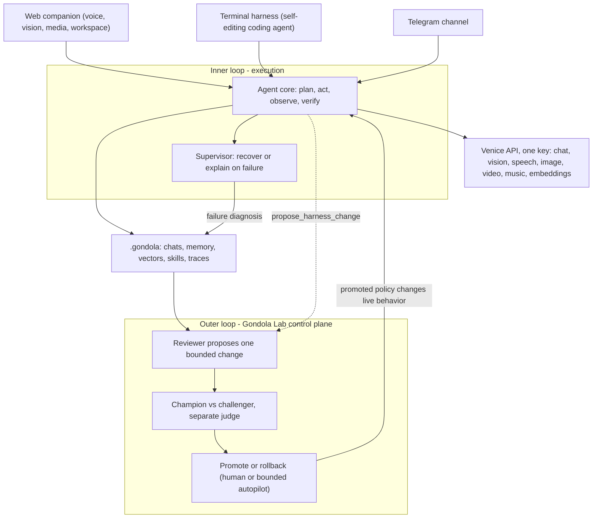

<p align="center">
  
</p>

<h1 align="center">Gondola</h1>

<p align="center">
  A local-first, self-improving AI agent: a voice/vision companion and self-editing coding harness, powered end to end by <a href="https://venice.ai">Venice AI</a>, with a control plane (Gondola Lab) that evaluates and promotes changes to how it works.
</p>

<p align="center">
  
  
  
</p>

Gondola pairs two front ends over one agent core. The terminal harness is a coding agent that reads, writes, edits, and runs code in its working directory, so pointed at its own repository it can edit itself. The web companion adds a voice and vision interface with an animated presence, a media tray, a workspace for agents and memory, and scheduled automations. Every model call goes through Venice, and your data stays on your machine.

What makes Gondola more than a chat app is the loop around the agent. An inner loop runs the task, and a supervisor recovers or explains instead of dead-ending when a turn fails. An outer loop, Gondola Lab, reads run traces, proposes one bounded change to the harness, evaluates a challenger against the current champion with a separate judge, and promotes only on your approval (or a bounded, opt-in autopilot). A promotion actually changes how the live agent behaves, and every change is reversible. The acting agent can flag its own recurring problems to the Lab, but it never grades or promotes itself.

## Install

Requirements: Node.js 20+ and a Venice inference API key.

```bash
git clone https://github.com/sabrinaaquino/gondola.git
cd gondola
npm install --ignore-scripts
cp .env.example .env.local   # then add your VENICE_API_KEY
```

## Usage

On first run, Gondola shows a guided setup that verifies your Venice key and turns on capabilities. Developers can skip it by adding a key to `.env.local` as above.

Terminal harness, operating on the current working directory:

```bash
npm run harness    # or `nova` after `npm link`
```

Describe a task in plain language and it investigates, edits files, and runs commands to carry it out. Run it in any project for a general coding agent; run it in this repository and it edits its own source. Slash commands: `/help`, `/model [id]`, `/models`, `/tools`, `/cwd`, `/reset`, `/clear`, `/exit`. Ctrl-C aborts a turn, twice to exit.

Web companion:

```bash
npm run dev        # then open the local URL it prints
```

The Venice key stays on the server and is never sent to the browser. `.env.example` documents two optional, server-only keys: `VENICE_ADMIN_KEY` (balance and usage analytics in the API X-ray) and `TELEGRAM_BOT_TOKEN` (the Telegram channel, which can also be set in the UI).

## Capabilities

| Capability | Description |
| --- | --- |
| Coding tools | Read, write, edit, list, search (ripgrep), and run shell commands, scoped to the working directory. Destructive actions require confirmation. |
| Semantic search | Recalls past conversations by meaning. Chunk-level Venice embeddings, indexed the way a codebase is, with hybrid lexical re-ranking so a term mentioned once still surfaces. |
| Model selection | Choose any Venice model per conversation, with automatic fallback when one is unavailable. Reasoning models can stream a collapsible thinking trace. |
| Sub-agents | Delegate a self-contained task to a scoped worker that reads, writes, and edits files, with a live task view of each step it takes. |
| Voice | Hands-free mode with end-of-turn detection: Venice speech-to-text, the agent, then streaming Venice speech. Interrupt anytime. |
| Vision | Samples webcam frames to notice gestures and objects you show it. Observations are spoken only during a voice session. |
| Media | Generate images, video, and music through Venice. Costly jobs are quoted and confirmed first. |
| Memory | Typed, local long-term memory with optional auto-capture and an approval workflow you control. |
| Automations | Schedule prompts that run on a cadence with no tab open, delivered to the chat or to Telegram. |
| Connections | MCP integrations (Gmail, Calendar, Slack, Notion, GitHub, Linear) or any custom MCP server, plus Telegram. |
| API X-ray | A live trace of every Venice call with latency, tokens, and the exact per-request cost from model list pricing. |
| Self-improvement (Gondola Lab) | An external control plane that reads run traces, proposes one bounded config change, evaluates a challenger against the champion with a separate judge, and promotes only on approval (or a bounded, opt-in autopilot). A promotion changes the live agent's behavior, and every change is reversible. |
| Self-recovery | When a turn fails, a supervisor tries a safe fallback and otherwise explains what broke, so the chat never dead-ends on a canned error. |
| Self-modification | Changes its own chat model on request, lists Venice's live model catalog, authors new abilities (pending your approval), and can flag recurring problems to the Lab for a reviewed fix. |

## Architecture



- Web companion (`src/app/`): the browser handles UI, webcam/mic, and audio; local Next.js API routes keep the Venice key private and stream agent events as newline-delimited JSON.
- Terminal harness (`src/cli/`, launched by `bin/nova.mjs`): a Pi `Agent` loop over Pi's sandboxed working-directory filesystem and shell, running on Node via `tsx`.
- Both share `src/lib/`: the Venice client, memory, model and stream setup, skills, MCP, sub-agents, search, and compaction.
- Pi Agent Core orchestrates the loop, tools, memory, and compaction. It does not replace Venice; every capability goes through the Venice API.
- Inner and outer loop (`src/lib/supervisor.ts`, `src/lib/lab/`): the supervisor recovers or explains failed turns; Gondola Lab reads traces, proposes bounded changes, evaluates a challenger against the champion with an independent judge, and folds a promoted policy into the live system prompt (harness benefit). The acting agent may propose but never grades or promotes itself, and disallowed areas (permissions, credentials, budgets, graders, thresholds, control-plane code, trace history) are off limits.

## Privacy and safety

- Conversations, agents, memory, skills, connections, automations, and generated media persist locally under `.gondola/` (git-ignored). The inference key stays server-side.
- The harness runs shell commands and edits files autonomously. Destructive actions require confirmation and it is instructed never to touch secrets, but you should run it on version-controlled code and review its diffs.
- This is a local, single-user tool, not a hardened multi-tenant deployment.

## Contributing

Issues and pull requests are welcome. See [CONTRIBUTING.md](./CONTRIBUTING.md) and the [Code of Conduct](./CODE_OF_CONDUCT.md).

## License

[MIT](./LICENSE) © Sabrina Aquino
